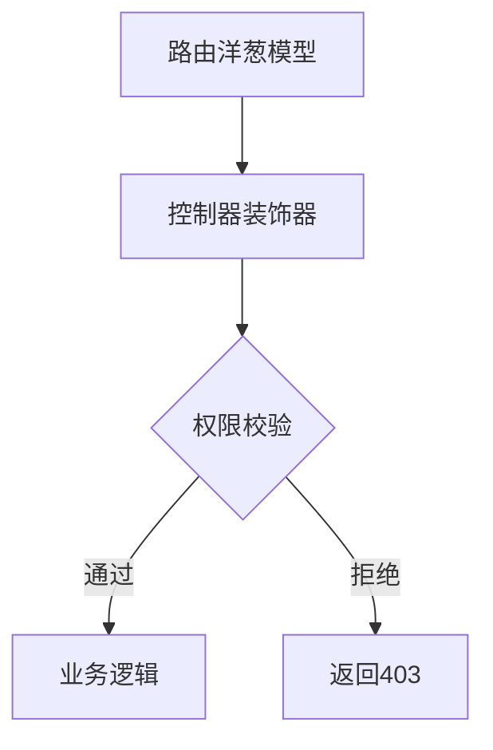

# Koa-Admin 企业级后台管理系统

[](https://github.com/yourname/koa-admin)
[](https://nodejs.org/)

## 项目背景
基于 Koa 框架开发的后台管理系统解决方案，参考若依开源框架设计理念，提供 RBAC 权限管理、功能即服务(FaaS)、动态表单等核心功能模块。

## 技术架构
### 后端技术栈
- **运行时**: Node.js 16.20.2
- **框架**: Koa@2 + TypeScript
- **数据库**: MongoDB + mongoose
- **安全**: JWT + RSA 加密登录
- **限流**: 接口级令牌桶限流算法

### 前端技术栈
- Vue3 + Element Plus
- Axios 封装请求拦截
- 动态路由加载
- RBAC 权限控制

## 核心功能
### 权限管理系统


#### 路由控制特性
1. 动态路由命名规范：
   - `Get|list` => GET /admin/route/list
   - `Update:id` => PUT /admin/route/:id
2. 中间件链式加载：
```javascript
middleLists: {
  "Get|list": [
    ApiAuth(["system:dictType:list"]), 
    ApiRatelimit(1, 3)
  ]
}
```

### FaaS 功能即服务
1. **动态模型创建**：
```javascript
modelSchemas.formSchema = mongoose.model('form', new Schema({
  id: Number,
  config: Schema.Types.Mixed
}))
```
2. **服务函数热加载**：
```javascript
// 函数更新后自动重新挂载路由
await FaasInit() 
```

### 特色功能
- **自动ID生成**：分布式自增ID服务
```javascript
const currentIndex = await AutoID({ code: "dictTypeId" })
```
- **接口级限流**：支持 QPS 和并发数控制
- **安全审计**：操作日志自动记录

## 快速开始
### 环境要求
- Node.js 16.20.2
- MongoDB 5.0+

### 启动命令
```bash
# 安装依赖
yarn

# 开发模式
yarn dev

# 集群模式（CPU核心数/2）
yarn cluster

# 生产构建
yarn build
```

## 架构设计
### 路由洋葱模型
```
┌───────────────────────────────────┐
│          API Request              │
└───────────────────────────────────┘
                   ▼
┌───────────────────────────────────┐
│        Rate Limiter Middleware    │
└───────────────────────────────────┘
                   ▼
┌───────────────────────────────────┐
│        Auth Middleware            │
└───────────────────────────────────┘
                   ▼
┌───────────────────────────────────┐
│      Business Controller          │
└───────────────────────────────────┘
```

## 贡献指南
欢迎提交 PR 或 issue，详细请参考[贡献文档](CONTRIBUTING.md)

## 开源协议
[MIT License](LICENSE.md)
参考若依开源封装基于koa版本的前后端分离框架，若感觉对你有用请给个start吧！
### 后端：
koa+mongodb;

### 前端：
vue3+Element Plus  

### 系统核心功能：

#### 权限管理：
基于路由洋葱模型路由，按照自定义规则封装：
    例如：
```
    class DictTypeAdminController extends BaseController {
    constructor({
        ctx = {
            state: {
                userInfo: {}
            }
        },
        next
    }) {
        super();
        this.ctx = ctx;
        this.next = next
        this.userInfo = this.ctx.state.userInfo;
        this.url = "/admin/dict-type"
        this.middleLists = {
            "Get|list": [ApiAuth(["system:dictType:list"]), ApiRatelimit(1, 3)],
            Create: [ApiAuth(["system:dictType:post"]), ApiRatelimit(1, 1)],
            "Update:id": [ApiAuth(["system:dictType:put"]), ApiRatelimit(1, 1)],
            "Remove:ids": [ApiAuth(["system:dictType:remove"]), ApiRatelimit(1, 1)],
            "Get|info:id": [ApiAuth(["system:dictType:get"]), ApiRatelimit(1, 3)],
        }
    }

    async "Get|list"() { // method：get; path:/admin/dict-type/list
        try {
            const {
                state = 1,
                    dictId,
                    dictLabel,
                    dictValue
            } = this.ctx.request.query
            const {
                page,
                skipIndex
            } = super.pager(this.ctx.request.query)
            const params = {}
            if (dictId) params.dictId = parseInt(dictId);
            params.state = parseInt(state);
            if (dictLabel) params.dictLabel = new RegExp(`${dictLabel}`, 'ig')
            if (dictValue) params.dictValue = new RegExp(`${dictValue}`, 'ig')
            const query = Schema.dictTypeSchema.find(params) // 查询所有数据
            const list = await query.sort({
                id: -1
            }).skip(skipIndex).limit(page.pageSize) // 根据查出的所有数据截取对应页数的数据
            const total = await Schema.dictTypeSchema.countDocuments(params);
            this.ctx.body = super.success({
                data: {
                    page: {
                        ...page,
                        total
                    },
                    list
                }
            })
        } catch (error) {
            this.ctx.body = super.fail({
                msg: error.stack
            })
        }
    }

    async Create() { // method：post;  path:/admin/dict-type
        try {
            const {
                dictId,
                dictLabel,
                dictValue,
                dictSort,
                state,
                remark
            } = this.ctx.request.body;
            if (!dictId || !dictLabel || !dictValue || !state) {
                this.ctx.body = super.fail({
                    msg: '请填写完整再进行新增提交'
                })
                return;
            } else {
                const currentIndex = await AutoID({
                    code: "dictTypeId"
                })
                const add = new Schema.dictTypeSchema({
                    id: currentIndex,
                    remark,
                    dictId,
                    createByUser: this.ctx.state.userId.id,
                    dictLabel,
                    dictValue,
                    dictSort,
                    state
                });
                await add.save();
                this.ctx.body = super.success({
                    msg: '添加成功'
                })
            }
        } catch (error) {
            this.ctx.body = super.fail({
                msg: error.stack
            })
        }
    }

    async "Update:id"() { // method：update;  path:/admin/dict-type/list/:id
        try {
            const {
                id
            } = this.ctx.params
            const {
                ...params
            } = this.ctx.request.body;
            params.updateTime = new Date();
            params.updateByUser = this.ctx.state.userId.id
            const res = await Schema.dictTypeSchema.findOneAndUpdate({
                id: parseInt(id)
            }, params, {
                new: true
            });
            this.ctx.body = super.success({
                data: res,
                msg: '修改成功！'
            })
        } catch (error) {
            this.ctx.body = super.fail({
                msg: error.stack
            })
        }
    }

    async "Remove:ids"() { // method：delete;  path:/admin/dict-type/list/:ids
        try {
            const {
                ids
            } = this.ctx.params
            let arrId = ids.split(",").filter((item) => item).map((item) => parseInt(item))
            let res = await Schema.dictTypeSchema.updateMany({
                id: {
                    $in: arrId
                }
            }, {
                state: 2
            });
            this.ctx.body = super.success({
                data: res,
                msg: `删除成功`
            })
        } catch (error) {
            this.ctx.body = super.fail({
                msg: error.stack
            })
        }
    }

    async "Get|type:code"() {
        try {
            const {
                code
            } = this.ctx.params
            let dictInfo = await Schema.dictSchema.findOne({
                nameCode: code
            })
            const query = await Schema.dictTypeSchema.find({
                dictId: dictInfo.id
            }) // 查询所有数据
            this.ctx.body = super.success({
                data: query,
            })
        } catch (error) {
            this.ctx.body = super.fail({
                msg: error.stack
            })
        }
    }

    async "Get|info:id"() {
        try {
            const {
                id
            } = this.ctx.params
            const params = {}
            if (id) params.id = parseInt(id)
            const query = await Schema.dictTypeSchema.findOne(params) // 查询所有数据
            this.ctx.body = super.success({
                data: {
                    ...query._doc
                }

            })
        } catch (error) {
            this.ctx.body = super.fail({
                msg: error.stack
            })
        }
    }
}
    
    module.exports = DictTypeAdminController;

```


所以controll类名支持两种：

1: Get、Update、Create、Remove

2: "Get|list"、"Get|list:id" ....
    
| 代表拼接后端字符串 

: 代表拼接后端动态路由 

##### middleLists

可以使用[middleLists]定义中间件插件从而实现动态权限，限流等功能


#### token验权：

#### token续期：

#### Rsa加密登录账户信息：

#### 功能即服务（FaaS）：

首先在模型管理内部添加模型
 
```
module.exports = async () => {
    modelSchemas.formSchema = mongoose.model('form', mongoose.Schema({
        id: Number,
        "state": {
            type: Number,
            default: 1
        },
        "name": String,
        "code": String,
        "config": mongoose.Schema.Types.Mixed,
        "createTime": {
            type: Date,
            default: Date.now()
        },
        updateTime: {
            type: Date,
            default: Date.now()
        },
        updateByUser:Number,
        createTime: {
            type: Date,
            default: Date.now()
        },
        createByUser:Number,
        remark: String
    }, {
        autoCreate: true
    }), 'form')
}
```
在faas函数模块添加具体函数
```
module.exports = async () => {
    await ApiAuth({
            userInfo: ctx.state.userInfo,
            code: ["faas:form:list"]
    })
    const {
        name,
        state = 1
    } = ctx.request.query
    const {
        page,
        skipIndex
    } = Tools.pager(ctx.request.query)
    const params = {}
    if (name) params.name = new RegExp(`${name}`, 'ig')
    params.state = parseInt(state);
    const query = modelSchemas.formSchema.find(params)
    const list = await query.sort({
        id: -1
    }).skip(skipIndex).limit(page.pageSize)
    const total = await modelSchemas.formSchema.countDocuments(params);
    return Tools.success({
        data: {
            page: {
                ...page,
                total
            },
            list
        }
    })
}
```

##### 参考

```
module.exports = async () => {
    modelSchemas.formSchema = mongoose.model('form', mongoose.Schema({
        id: Number,
        "state": {
            type: Number,
            default: 1
        },
        "name": String,
        "code": String,
        "config": mongoose.Schema.Types.Mixed,
        "createTime": {
            type: Date,
            default: Date.now()
        },
        updateTime: {
            type: Date,
            default: Date.now()
        },
        updateByUser: Number,
        createTime: {
            type: Date,
            default: Date.now()
        },
        createByUser: Number,
        remark: String
    }, {
        autoCreate: true
    }), 'form')
}


// list
module.exports = async () => {
    const {
        name,
        state = 1
    } = ctx.request.query
    const {
        page,
        skipIndex
    } = Tools.pager(ctx.request.query)
    const params = {}
    if (name) params.name = new RegExp(`${name}`, 'ig')
    params.state = parseInt(state);
    const query = modelSchemas.formSchema.find(params)
    const list = await query.sort({
        id: -1
    }).skip(skipIndex).limit(page.pageSize)
    const total = await modelSchemas.formSchema.countDocuments(params);
    return Tools.success({
        data: {
            page: {
                ...page,
                total
            },
            list
        }
    })
}
// get
module.exports = async () => {
    const {
        id,
    } = ctx.request.query
    if (!id) {
        throw ExceptionCode.INVALID_PARAMS
    }
    const params = {}
    params.id = parseInt(id);
    const query = await modelSchemas.formSchema.findOne(params)

    return Tools.success({
        data: {
            ...query._doc
        }
    })
}


// update
module.exports = async () => {
    const {
        ...params
    } = ctx.request.body;
    if (!params.id) {
        throw ExceptionCode.INVALID_PARAMS
    }
    params.updateTime = new Date();
    params.updateByUser = ctx.state.userId.id
    const res = await modelSchemas.formSchema.findOneAndUpdate({
        id: parseInt(params.id)
    }, params, {
        new: true
    });
    return Tools.success({
        data: res,
        msg: '修改成功！'
    })
}

// remove
module.exports = async () => {
    const {
        ids
    } = ctx.query;
    if (!ids) {
        throw ExceptionCode.INVALID_PARAMS
    }

    let arrId = ids.split(",").filter((item) => item).map((item) => parseInt(item))
    let res = await modelSchemas.formSchema.updateMany({
        id: {
            $in: arrId
        }
    },{
        state:2
    })
    return Tools.success({
        data: res,
        msg: '修改成功！'
    })
}


// post
module.exports = async () => {
    const {
        name,
        code,
        config
    } = ctx.request.body
    const ID = await AutoID({
        code: "formId"
    })
    const add = new modelSchemas.formSchema({
        id: ID,
        createByUser: ctx.state.userId.id,
        name,
        code,
        config
    });
    await add.save();
    return Tools.success({
        msg: '添加成功'
    })
}


module.exports = async () => {
    if (!modelSchemas.projectSchemas) {
        modelSchemas.projectSchemas = mongoose.model('project', mongoose.Schema({
            "name": String,
            "startTime": {
                type: Date,
                default: Date.now()
            },
            "makeTime": {
                type: Date,
                default: Date.now()
            },
            "endTime": {
                type: Date,
                default: Date.now()
            },
            "state": {
                type: String,
                default: 1
            },
            "company": String,
            userInfo: {
                type: mongoose.Schema.Types.ObjectId,
                ref: 'users'
            },
            "createTime": {
                type: Date,
                default: Date.now()
            },
            "lastLoginTime": {
                type: Date,
                default: Date.now()
            },
            remark: String
        }, {
            autoIndex: true,
            autoCreate: true
        }), 'project')
    }
}
```

#### 接口权限控制：

#### 接口级别限流：

#### 动态表单等：

## 本项目（约定优于配置）

### 数据库基础数据
数据库基础数据 查看db文件夹

<!--### mongoose.Schema 支持类型  
 [https://mongoosejs.com/docs/guide.html]
 String
Number
Date
Buffer
Boolean
Mixed
ObjectId
Array
Decimal128
Map -->

<!-- # 体验 -->
<!-- [后台管理系统链接](https://s1.z100.vip:8555/vue/welcome) -->
<!-- 
账户：admin@qq.com

密码：123456 -->

## 运行

node v16.20.2

yarn

yarn dev : 单线程线程运行模式

yarn cluster : 多线程运行模式（默认本地电脑cpu线程数/2） (具体查看cluster.js)
